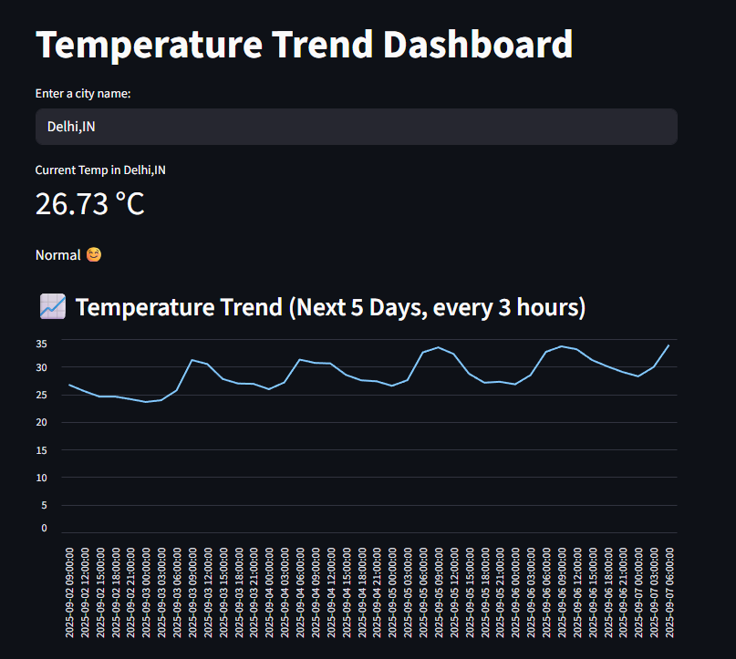

Got it 👍 Here’s the **README.md file content** in ready-to-save format:

---

# 🌡️ Temperature Trend Dashboard

A simple **real-time temperature dashboard** built with **Streamlit** and the **OpenWeather API**.
It shows the **current temperature**, classifies it as *Hot*, *Cold*, or *Normal*, and visualizes the **temperature trend for the next 5 days (3-hour intervals)**.

---

## 🚀 Features

* Enter any city (format: `City,CountryCode`, e.g., `Delhi,IN` or `London,GB`).
* Displays **current temperature** with an emoji indicator:

  * 🥵 Too Hot (above 35°C)
  * 🥶 Too Cold (below 10°C)
  * ☺️ Normal
* **Line chart** showing forecast trend over the next 5 days.
* Uses **free OpenWeather API**.

---

## 🛠️ Tech Stack

* [Python 3](https://www.python.org/)
* [Streamlit](https://streamlit.io/)
* [Requests](https://docs.python-requests.org/en/master/)
* [Pandas](https://pandas.pydata.org/)
* [OpenWeather API](https://openweathermap.org/)

---

## 📦 Installation

1. Clone the repository:

   ```bash
   git clone https://github.com/your-username/temperature-dashboard.git
   cd temperature-dashboard
   ```

2. Install dependencies:

   ```bash
   pip install -r requirements.txt
   ```

   **requirements.txt**

   ```
   streamlit
   requests
   pandas
   ```

3. Get a free API key from [OpenWeather](https://home.openweathermap.org/users/sign_up).

4. Open `app.py` and replace the placeholder with your API key:

   ```python
   API_KEY = "your_api_key_here"
   ```

---

## ▶️ Usage

Run the app with:

```bash
streamlit run app.py
```

Open your browser at `http://localhost:8501` to use the dashboard.

---

## 📸 Screenshot




---

## ⚡ Example Inputs

* `Delhi,IN`
* `London,GB`
* `New York,US`
* `Tokyo,JP`

---

## 🙌 Acknowledgments

* [OpenWeather API](https://openweathermap.org/) for weather data.
* [Streamlit](https://streamlit.io/) for the interactive dashboard.


